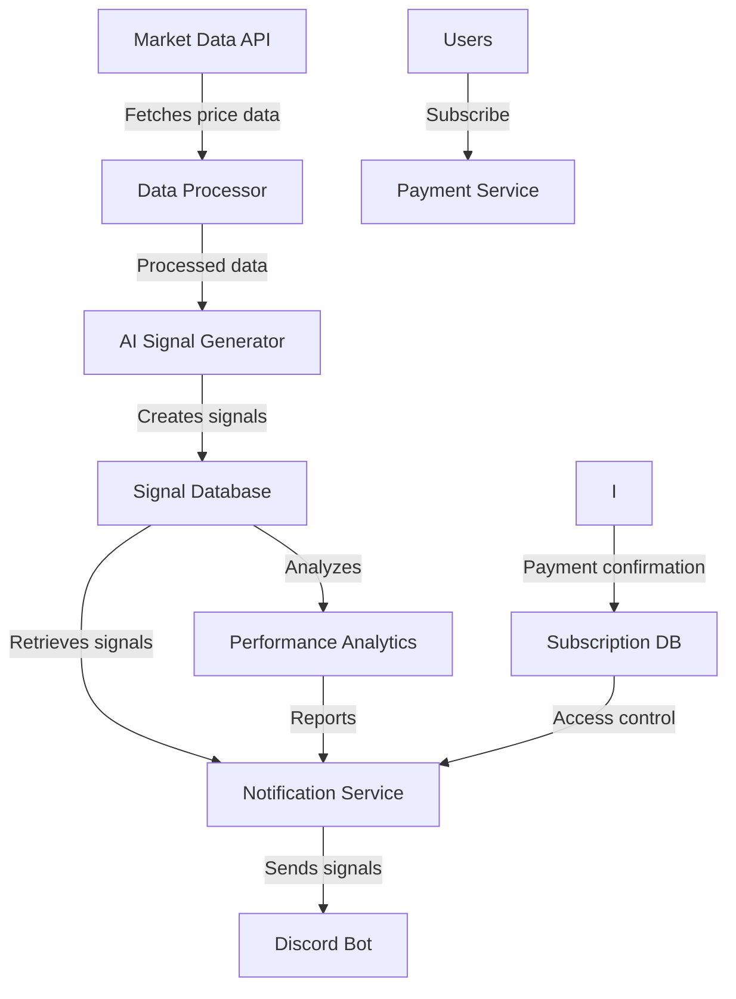
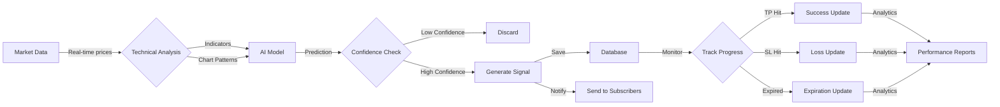
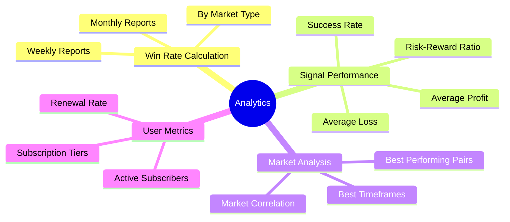
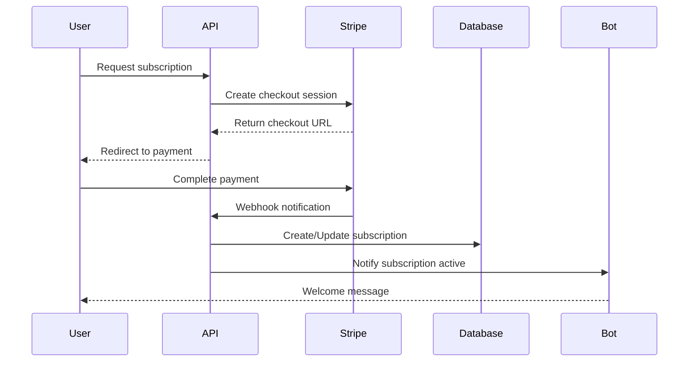
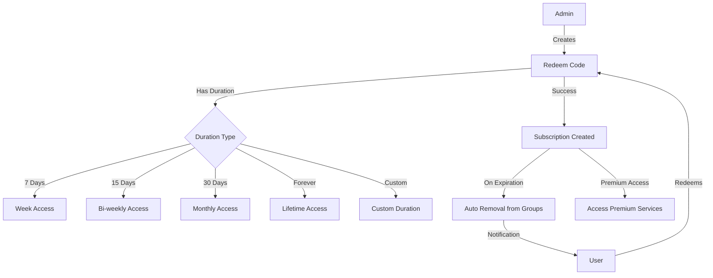

# ZombitX64 AI Signal Provider

An AI-powered trading signal provider system with Discord integration and subscription model.

## 🧠 Features

- **AI Signal Generation**: Uses machine learning models to analyze market data and generate trading signals
- **Discord Bot Integration**: Sends trading signals and updates directly to Discord channels
- **Subscription Model**: Monetization through Stripe payment processing or redeem codes
- **Real-time Updates**: Notifies users when TP or SL are hit via Discord
- **Admin Dashboard**: Manage signals, users, and subscriptions
- **Performance Analytics**: Weekly and monthly win rate reports sent to subscribers
- **Redeem Codes**: Generate subscription codes with predefined durations (7, 15, 30 days or forever)
- **Auto-Expiration**: Automatically removes users from premium groups when subscriptions expire

## 🔄 System Architecture



## 🚀 Signal Generation Workflow



## 📈 Performance Analytics Mind Map



## 💳 Subscription System Flow



## 📱 Discord Bot Integration
- Receives real-time signals and updates directly in designated Discord channels
- Displays rich embeds with signal details and performance reports
- Admin commands for broadcasting messages and managing notifications

## 🚀 Tech Stack

- **Backend**: Python + FastAPI
- **Database**: Supabase (PostgreSQL)
- **AI Models**: NumPy, Pandas, TensorFlow/PyTorch
- **Market Data**: Integration with Binance API
- **Bots**: Telegram Bot API (aiogram)
- **Payments**: Stripe API
- **Deployment**: Docker, Kubernetes, Supabase

## 🗄️ Setting up Supabase

1. **Create Supabase Project**
   - Go to [Supabase Dashboard](https://app.supabase.io)
   - Create a new project
   - Get your project URL and anon/public key

2. **Setup Environment Variables**
   ```bash
   # Database
   SUPABASE_URL=your_project_url
   SUPABASE_KEY=your_anon_key
   ```

3. **Run Database Migrations**
   ```bash
   # Install Supabase CLI
   npm install -g supabase-cli

   # Login to Supabase
   supabase login

   # Link your project
   supabase link --project-ref your-project-ref

   # Run migrations
   supabase db push
   ```

## 🚂 Railway Deployment

1. **Install Railway CLI**
   ```bash
   # For Windows
   scoop bucket add railway https://github.com/railway/scoop-railway
   scoop install railway

   # For macOS
   brew install railway

   # For other platforms
   npm i -g @railway/cli
   ```

2. **Login to Railway**
   ```bash
   railway login
   ```

3. **Initialize Railway Project**
   ```bash
   railway init
   ```

4. **Add Required Services**
   - Add PostgreSQL from Railway Dashboard
   - Add Redis from Railway Dashboard

5. **Configure Environment Variables**
   ```bash
   # Set required environment variables
   railway variables set POSTGRES_DB=signal_zombitx64
   railway variables set DISCORD_BOT_TOKEN=your_discord_token
   # Add other required environment variables
   ```

6. **Deploy Application**
   ```bash
   railway up
   ```

7. **Monitor Deployment**
   - View logs: `railway logs`
   - Check status: `railway status`
   - Open dashboard: `railway open`

Railway will automatically:
- Build the application using the Dockerfile
- Set up PostgreSQL and Redis instances
- Configure environment variables
- Handle SSL certificates
- Provide a public URL

## 📋 Prerequisites

- Python 3.9+
- PostgreSQL
- Binance API Key
- Telegram Bot Token
- Stripe API Key

## 🛠️ Installation
1. **Clone the repository**
    ```bash
    git clone https://github.com/yourusername/Signal-zombitx64.git
    cd Signal-zombitx64
    ```

2. **Set up environment variables**
    ```bash
    cp .env.example .env
    # Add your Supabase URL and key to .env file
    ```

3. **Set up Python environment**
    ```bash
    # Create virtual environment
    python -m venv venv
    
    # Activate virtual environment
    # Windows
    .\venv\Scripts\activate
    # Linux/Mac
    source venv/bin/activate
    
    # Install dependencies
    pip install -r requirements.txt
    ```

4. **Run Database Migrations**
    ```bash
    # Run migrations through Supabase CLI
    supabase db push
    ```

5. **Run the application**
    ```bash
    # Development
    uvicorn app.main:app --reload
    
    # Production
    uvicorn app.main:app --host 0.0.0.0 --port 8000
    ```

6. **Docker Support**
    ```bash
    # Build and run with Docker
    docker build -t signal-zombitx64 .
    docker run -p 8000:8000 signal-zombitx64
    
    # Or using Docker Compose
    docker-compose up -d
    ```
   ```

## 📝 API Documentation

After starting the application, access the interactive API documentation at:
- Swagger UI: http://localhost:8000/docs
- ReDoc: http://localhost:8000/redoc

## 📊 Signal Generation System

The system uses a combination of technical indicators and AI models to generate trading signals:

```
Signal Generation Logic
│
├── Technical Analysis
│   ├── RSI (Relative Strength Index)
│   ├── MACD (Moving Average Convergence Divergence)
│   ├── Bollinger Bands
│   └── Ichimoku Cloud
│
├── Machine Learning
│   ├── Feature Extraction
│   ├── Signal Classification
│   └── Confidence Scoring
│
└── Signal Validation
    ├── Risk/Reward Calculation
    ├── Market Condition Check
    └── Strategy Selection
```

## 💰 Subscription Tiers

- **FREE**: Basic signals with limited features
- **BASIC**: $29.99/month - All crypto signals
- **PREMIUM**: $49.99/month - Crypto + forex signals
- **VIP**: $99.99/month - All signals + exclusive strategies

## 🎟️ Redeem Code System

The platform offers a flexible redeem code system:



### Available Durations:
- **7-Day Access**: Perfect for trial subscriptions
- **15-Day Access**: Bi-weekly subscription
- **30-Day Access**: Standard monthly subscription
- **Lifetime Access**: Permanent subscription without expiration
- **Custom Duration**: Admin-defined custom subscription length

## 📱 Bot Commands

### Telegram Bot
- `/start` - Start the bot and register
- `/help` - Show help information
- `/signals` - Get latest signals
- `/subscription` - Check subscription status
- `/weekly_report` - Request weekly performance report
- `/monthly_report` - Request monthly performance report
- `/redeem` - Redeem a subscription code

## 🧪 Testing

```bash
pytest
```

## 📄 License

This project is licensed under the MIT License - see the LICENSE file for details.