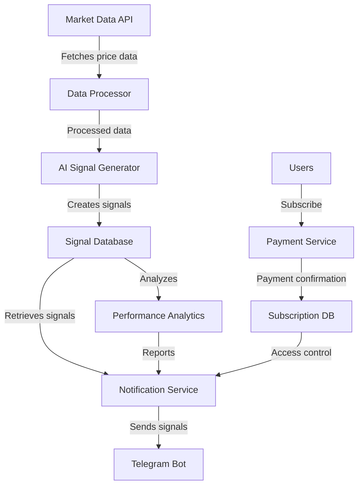
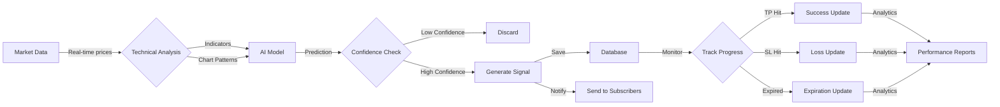
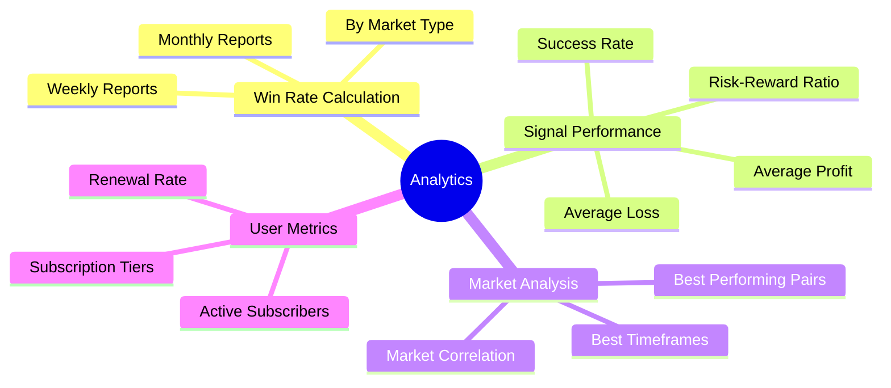
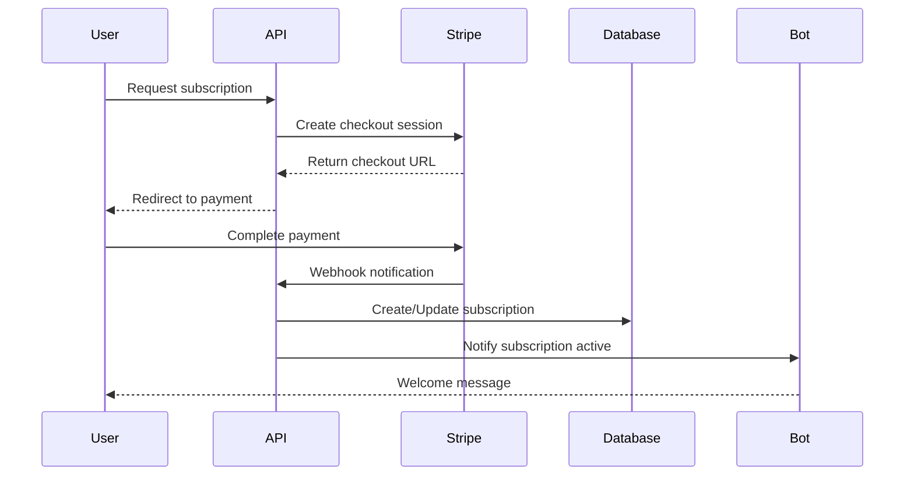
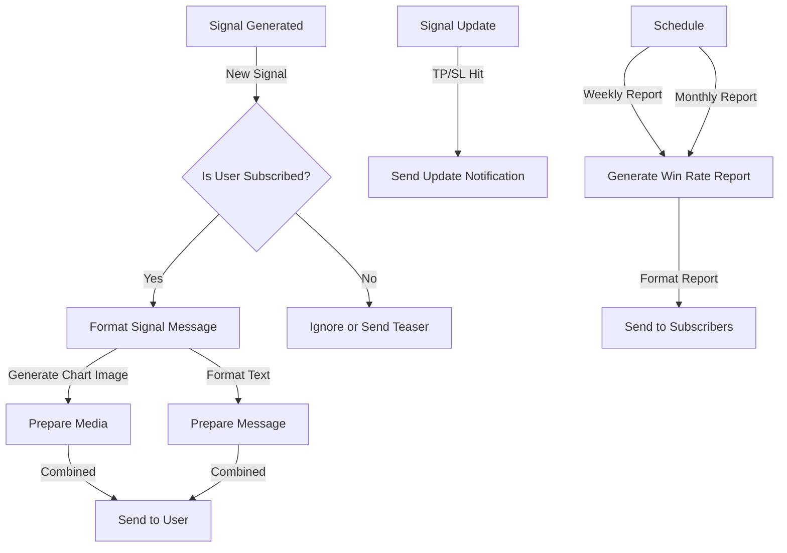
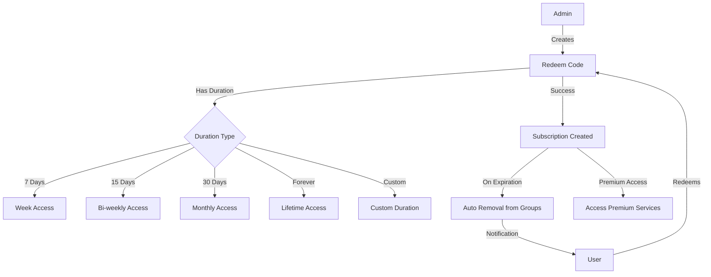

# ZombitX64 AI Signal Provider

An AI-powered trading signal provider system with Telegram integration and subscription model.

## 🧠 Features

- **AI Signal Generation**: Uses machine learning models to analyze market data and generate trading signals
- **Telegram Bot Integration**: Sends signals directly to users via Telegram
- **Subscription Model**: Monetization through Stripe payment processing or redeem codes
- **Real-time Updates**: Notifies users when TP or SL are hit
- **Admin Dashboard**: Manage signals, users, and subscriptions
- **Performance Analytics**: Weekly and monthly win rate reports sent to subscribers
- **Redeem Codes**: Generate subscription codes with predefined durations (7, 15, 30 days or forever)
- **Auto-Expiration**: Automatically removes users from premium groups when subscriptions expire

## 🔄 System Architecture



## 🚀 Signal Generation Workflow



## 📈 Performance Analytics Mind Map



## 💳 Subscription System Flow



## 📱 Telegram Bot Integration



## 🚀 Tech Stack

- **Backend**: Python + FastAPI
- **Database**: PostgreSQL
- **AI Models**: NumPy, Pandas, TensorFlow/PyTorch
- **Market Data**: Integration with Binance API
- **Bots**: Telegram Bot API (aiogram)
- **Payments**: Stripe API
- **Deployment**: Docker, Kubernetes

## 📋 Prerequisites

- Python 3.9+
- PostgreSQL
- Binance API Key
- Telegram Bot Token
- Stripe API Key

## 🛠️ Installation

1. **Clone the repository**
   ```bash
   git clone https://github.com/yourusername/Signal-zombitx64.git
   cd Signal-zombitx64
   ```

2. **Set up environment variables**
   ```bash
   cp .env.example .env
   # Edit .env file with your configuration
   ```

3. **Run with Docker Compose**
   ```bash
   docker-compose up -d
   ```

4. **Alternatively, install dependencies and run locally**
   ```bash
   pip install -r requirements.txt
   uvicorn app.main:app --reload
   ```

## 📝 API Documentation

After starting the application, access the interactive API documentation at:
- Swagger UI: http://localhost:8000/docs
- ReDoc: http://localhost:8000/redoc

## 📊 Signal Generation System

The system uses a combination of technical indicators and AI models to generate trading signals:

```
Signal Generation Logic
│
├── Technical Analysis
│   ├── RSI (Relative Strength Index)
│   ├── MACD (Moving Average Convergence Divergence)
│   ├── Bollinger Bands
│   └── Ichimoku Cloud
│
├── Machine Learning
│   ├── Feature Extraction
│   ├── Signal Classification
│   └── Confidence Scoring
│
└── Signal Validation
    ├── Risk/Reward Calculation
    ├── Market Condition Check
    └── Strategy Selection
```

## 💰 Subscription Tiers

- **FREE**: Basic signals with limited features
- **BASIC**: $29.99/month - All crypto signals
- **PREMIUM**: $49.99/month - Crypto + forex signals
- **VIP**: $99.99/month - All signals + exclusive strategies

## 🎟️ Redeem Code System

The platform offers a flexible redeem code system:



### Available Durations:
- **7-Day Access**: Perfect for trial subscriptions
- **15-Day Access**: Bi-weekly subscription
- **30-Day Access**: Standard monthly subscription
- **Lifetime Access**: Permanent subscription without expiration
- **Custom Duration**: Admin-defined custom subscription length

## 📱 Bot Commands

### Telegram Bot
- `/start` - Start the bot and register
- `/help` - Show help information
- `/signals` - Get latest signals
- `/subscription` - Check subscription status
- `/weekly_report` - Request weekly performance report
- `/monthly_report` - Request monthly performance report
- `/redeem` - Redeem a subscription code

## 🧪 Testing

```bash
pytest
```

## 📄 License

This project is licensed under the MIT License - see the LICENSE file for details.