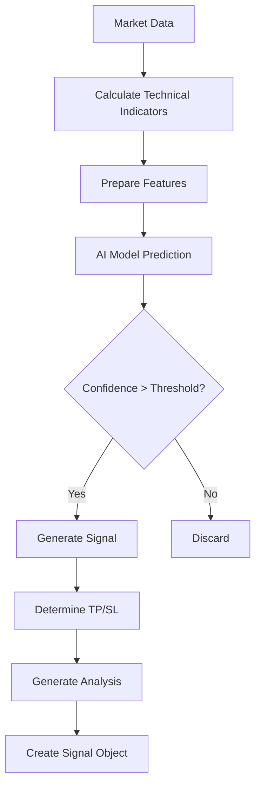

# ZombitX64 AI Trading Signal Components

This directory contains the AI and technical analysis components for the ZombitX64 trading signal system.

## Components

### Indicators (`indicators.py`)

Contains implementations of various technical indicators used for trade signal generation:

- **Standard Indicators**
  - RSI (Relative Strength Index)
  - MACD (Moving Average Convergence Divergence)
  - Bollinger Bands
  - SMA/EMA (Simple/Exponential Moving Averages)
  - Stochastic Oscillator
  - ADX (Average Directional Index)

- **Advanced Indicators**
  - Ichimoku Cloud (Complete implementation)
  - Fibonacci Retracement
  - Support/Resistance Detection
  - Pivot Points (Standard, Fibonacci, Camarilla, Woodie)
  - OBV (On-Balance Volume)

### Model Loader (`model_loader.py`)

Loads AI models for predicting trading signals:

- **Model Types**
  - LSTM (Long Short-Term Memory)
  - GRU (Gated Recurrent Unit)
  - CNN-LSTM (Convolutional + LSTM hybrid)
  - Random Forest
  - Gradient Boosting
  - Ensemble (combination of multiple models)
  - Reinforcement Learning models

### Signal Generator (`signal_generator.py`)

Generates trading signals by:
1. Fetching market data
2. Calculating technical indicators
3. Applying AI models
4. Determining entry points, take profit and stop loss levels
5. Generating analysis text

## Usage

### Signal Generation Process

### Training Models

Models are trained using historical market data with the notebook in `notebooks/train_ai_model.ipynb`.
To train new models:

1. Run the training notebook
2. Models are saved to the `models/` directory
3. Create ensemble using `scripts/create_ensemble_model.py`

## Adding New Indicators

To add a new indicator:

1. Add calculation function in `indicators.py`
2. Add the indicator to `calculate_all_indicators()` function
3. Update feature generation in `signal_generator.py`

## Adding New Models

To add a new model type:

1. Create a new model class in `model_loader.py`
2. Add the model type to the `ModelType` enum
3. Update the `load_model_by_type()` function to handle the new model
4. Train the model and save it to the `models/` directory
